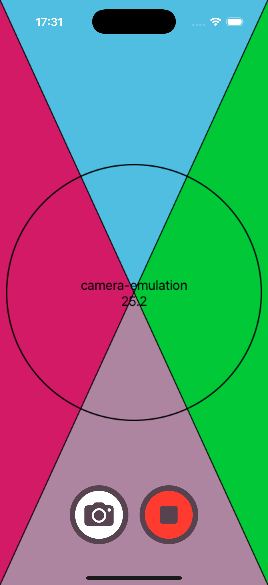

# CameraSimulation

CameraSimulation is a Swift package that enables camera functionality in iOS Simulator. Perfect for developing and testing camera-dependent flows and features without needing a physical device.

## Features
- Simulate camera preview with CALayer
- Capture "photo" (snapshot) and video from the preview
- Creates repeatable content for tests

{width=30%} {width=30%} {width=30%}

## Installation

Add CameraSimulation to your `Package.swift` dependencies:

```swift
.package(url: "https://gitlab.com/xymatic-public/camerasimulation.git", from: "0.2.0")
```

Or use Xcode's Swift Package Manager integration:
1. File > Add Packages...
2. Enter the repository URL

## Usage

Import the package in your Swift file:

```swift
import CameraSimulation
```

### CameraSimulationLayer

`CameraSimulationLayer` is the replacement for `AVCaptureVideoPreviewLayer` that works in iOS Simulator:

- `func start()` - similar to `AVCaptureSession.startRunning()` - starts the animation
- `func stop()` - similar to `AVCaptureSession.stopRunning()` - stops the animation
- `var snapshot: UIImage` - creates the photo
- `func startRecording(to url: URL)` - starts recording the video to a local url
- `func stopRecording() async -> URL?` - stops recording and provides the url with the result

Check `Example` project for the variant of integration into an application

## Contributing

Contributions are welcome! Please open issues or submit pull requests.

## License

This project is licensed under the MIT License. See [LICENSE](LICENSE) for details.
